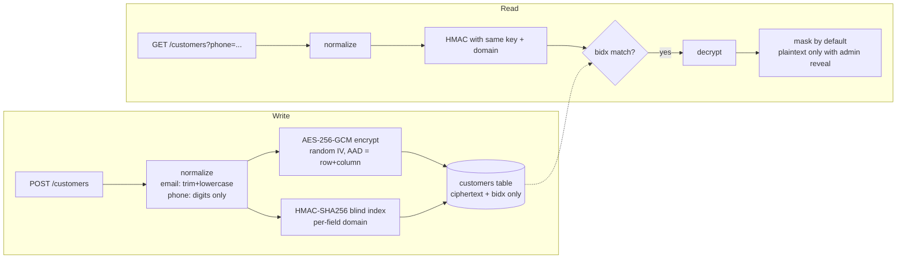

# pii-field-encryption

Field-level encryption for personal data with searchable blind indexes: encrypt at rest, still look records up by phone or email, never store plaintext.

## Problem

Encrypting a column normally breaks `WHERE phone = ?`. Storing the value in clear (or as a plain hash) to keep lookups working defeats the point. This repo shows the standard compromise: each personal field is encrypted with AES-256-GCM, and a separate keyed HMAC "blind index" allows exact-match lookup without revealing the value.

## How it works



- **Ciphertext** is `enc:v1:` + base64(`iv | tag | ciphertext`). The IV is random per call, so equal inputs give different outputs.
- **AAD binding**: each ciphertext is authenticated together with `customers:<id>:<field>`, so copying a value into another column or row makes decryption fail.
- **Blind index** is `HMAC-SHA256(PII_BIDX_KEY, domain + NUL + normalized value)`, with `domain` = `customers.email` or `customers.phone`. The same digits in the email and phone fields produce unrelated indexes.
- **Two independent keys** (`PII_ENC_KEY`, `PII_BIDX_KEY`), both from the environment, never stored in the database.
- `GET /customers/:id` is masked by default. `?reveal=1` returns plaintext only with header `x-role: admin`. **That header is a demo stand-in for real authentication**; anyone can send it. A real service must authenticate the caller and authorize server-side.
- `src/vault/passphraseVault.js` is a separate, optional browser-side layer (PBKDF2 + AES-GCM via Web Crypto) for data the server should never be able to read. It is tested but not wired into the API.

## Tech

Node 24 (`>=22.13`), [Hono](https://hono.dev) + `@hono/node-server`, built-in `node:sqlite`, built-in `node:crypto`, `node --test`. No Docker, no external services.

## Quick start

```bash
git clone https://github.com/abdalrahmnamo-svg/pii-field-encryption.git
cd pii-field-encryption
npm ci
npm run genkeys   # writes .env with two random 32-byte keys (git-ignored)
npm run seed      # 60 synthetic customers -> ./data/customers.db
npm start         # http://127.0.0.1:3000
npm test          # 33 tests
```

`npm run seed` is deterministic and also writes `samples/customers.sample.json` (synthetic plaintext). Customer 0043 has phone `+1-555-0142`.

### What's in the database

`npm run dump-db` prints raw rows, ciphertext and indexes only (shortened here):

```json
{
  "id": "2c6d4d98-daa3-4b67-8946-fd0d50dfd2cb",
  "name_enc": "enc:v1:XMxjBLjHctko/LBp+FYmmTpy3t4Aht4y+rUZ...",
  "email_enc": "enc:v1:XgMHivURvliXXgkWRFD7GF9f7cTusJ4WU5c0...",
  "phone_enc": "enc:v1:wcwBLmqTrCw8DFeo4eHcYZF3iQXc4SWjCAjR...",
  "notes_enc": "enc:v1:8mZsq9UEbA1wsqziE2A4clatYzWO78SummOi...",
  "email_bidx": "2edd4b54d4acac189e9369c0472b444f58692d5a797e449d8e83addf83eb74ca",
  "phone_bidx": "9256c64aef0729b31bb14e009fb6bf924e111410d7576d82c18251399152f7bb",
  "created_at": "2024-01-02T00:00:00.000Z"
}
```

(Ciphertext and indexes differ on every machine because your keys differ.)

## Example calls

```bash
# Create (email is normalized, phone digits are indexed)
curl -s -X POST http://127.0.0.1:3000/customers \
  -H "content-type: application/json" \
  -d '{"name":"Dana Example","email":"Dana@Example.com","phone":"+1-555-0199","notes":"Call +1-555-0199 after 5"}'

# Look up by phone (any formatting that includes the country code), masked results
curl -s -G http://127.0.0.1:3000/customers --data-urlencode "phone=+1 (555) 0199"

# Look up by email
curl -s -G http://127.0.0.1:3000/customers --data-urlencode "email=dana@example.com"

# Masked read by id (use an id from the responses above)
curl -s http://127.0.0.1:3000/customers/<id>

# Reveal without the role: 403
curl -s -w "\n%{http_code}\n" "http://127.0.0.1:3000/customers/<id>?reveal=1"

# Reveal with the demo role header: plaintext
curl -s "http://127.0.0.1:3000/customers/<id>?reveal=1" -H "x-role: admin"
```

## Threat model

| Attacker | Sees | Cannot |
|---|---|---|
| **DB dump / backup leak** | `enc:v1:` blobs, blind indexes, row ids, timestamps, which rows have an email/phone (NULL vs not) | Read any field. Test guessed phone/email values, because the HMAC key is not in the DB. |
| **Log leak** | Request URLs and audit lines. The server logs only `{event, customerId}` and returns generic errors; request bodies are never logged. | Recover PII, unless a reverse proxy in front logs query strings. `?phone=` and `?email=` are in the URL, so scrub proxy logs or switch lookups to `POST` in production. |
| **Insider with DB access, no env** | Same as a DB dump. Can delete or overwrite rows, but swapped or edited ciphertext fails GCM authentication. | Decrypt, or move a value between rows/columns undetected. |
| **Insider with DB + env keys** | Everything. | Nothing: field encryption does not defend against someone who holds the keys. Keep keys in a secret manager, separate from the DB and its backups. |
| **Running-app compromise** | Plaintext in memory while handling requests. | Out of scope. |

## What blind indexes can't do

- **Equality only.** No `LIKE`, prefix, range, or sort on the plaintext value.
- **Frequency leakage.** Equal values share an index, so a DB reader sees which rows share a phone/email and how often. For low-entropy fields (a boolean, a country, a small set of statuses) the index is nearly as revealing as plaintext; don't blind-index those.
- **Guessable values.** Phone numbers have a small space. Without the key an attacker cannot test guesses, but if `PII_BIDX_KEY` leaks, every phone can be brute-forced quickly.
- **Normalization is part of the contract.** Changing `normalize.js` changes every index; plan a reindex.
- Lookups can return several rows (shared phone), which is why the lookup endpoints return a list.

## Key custody and rotation

- Generate keys with `npm run genkeys` (`crypto.randomBytes(32)`). Keep them out of git; production should use a secret manager or KMS rather than a `.env` file.
- **Losing `PII_ENC_KEY` makes the data unrecoverable.** Back it up separately from the database.
- Ciphertext carries a version prefix so rotation can be rolling rather than big-bang. Not implemented here; the intended design:
  1. Add `enc:v2:` (new key id and/or algorithm) to `fieldCrypto.js`. `decryptField` dispatches on prefix and tries v1 and v2; `encryptField` always writes v2.
  2. Deploy with both keys configured. Old rows stay readable.
  3. A background job re-encrypts v1 rows to v2 (read, decrypt, encrypt, update), then v1 is retired.
  4. Blind indexes have no prefix, so rotating `PII_BIDX_KEY` means recomputing the `*_bidx` columns from decrypted values (or adding `*_bidx_v2` columns and querying both during the migration).

## Limitations

- Demo auth: `x-role: admin` is not security. Real deployments need authentication, authorization, and an audit trail stored somewhere durable.
- No rate limiting. An authenticated caller can enumerate by trying lookups.
- Single SQLite file, no migrations framework, no update or delete endpoints.
- `node:sqlite` is still marked experimental in Node (the warning is silenced in the npm scripts).
- Key rotation is described, not built.
- Data in `samples/` and the seed script is entirely synthetic.

## Background

Extracted from a production system I designed and built for customer-experience QA. This public version uses synthetic data.
